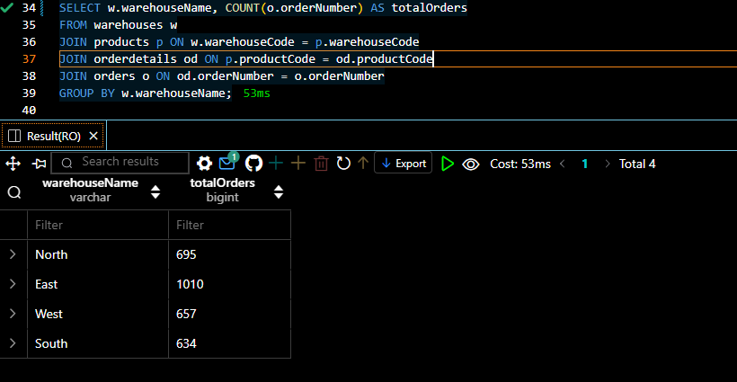
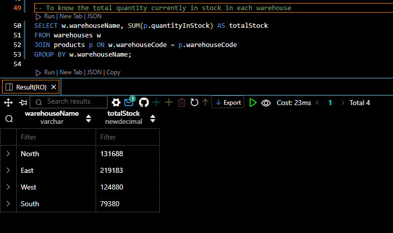

# Mintclassics
## Project Overview
Mint Classics Company, a retailer of classic model cars and other vehicles, is looking at closing one of their storage facilities. 
To support a data-based business decision, they are looking for suggestions and recommendations for reorganizing or reducing inventory, while still maintaining timely service to their customers. They would like to maintain the delivery period which is 24hours after order is being placed.
## Aim and Objectives
### Aim 
To close down one storage facilities
### Objectives
1. Explore products currently in inventory.

2. Determine important factors that may influence inventory reorganization/reduction.

3. Provide analytic insights and data-driven recommendations.
## Tools used 
SQL, Visual studio code.
## Data Exploration
This is crucial step that enable us to understand the data available in MintClassics Database. 
The image below shows the overall table available in the database 

Now that we know the tables available in the database, lets go deeper by exploring the warehouse table 

## INVENTORY ANALYSIS
To explore the products in inventory, information about the products, warehouses, and potentially orderdetails tables are needed. 

The screenshot below determined the Number of orders from each warehouse

The below shows the total quantity of products currently in stock in each warehouse

The screenshots below was used to retrieve the low performing stock and the storage for this low performing stock.

## WAREHOUSE PERFORMANCE
### PRODUCTS IN STOCK
* Highest product in Stock: The inventory analysis showed that _2002 Suzuki XREO_ is the highest product in stock with quanitity in stock of **9997** and this is stored in **NORTH** Warehouse  
* Lowest Product in Stock: The lowest product in stock which is _11960 BSA Gold Star DBD34_ with the quanity of **15** are also stored in Warehouse **NORTH**. 
### PRODUCTS SOLD
* Least Product Sold: Further analaysis also showed that the **least product sold** is 1957 ford thunderbird with overall quantity ordered of 767 stored in the EAST
* Highest Product Sold: The highest sold product is 1992 Ferrari 360 Spider red with overall quantity ordered of **1808** also stored in the EAST warehouse.
### TOTAL ORDERS
* Highest Total Orders: The total orders by warehouse analysis done also indicates that Highest Total Orders of **1010** has been sold from EAST Warehouse 
* Lowest Total Orders: West has sold the least orders of 657 just slightly different from that of North Warehouse with total Orders of 695. 
### GRAND TOTAL IN STOCK PER WAREHOUSE
* Least Stock: Currently, the stock analysis shows that, SOUTH Warehouse has the least products in stock with 79380, followed by WEST and NORTH with quanitity of 124880 and 131688 respectively. 
* Highest Stock: While the EAST has the highest quanity of products in stock. 
### LOW PERFORMING PROCUCT
An analysis of the low performing product was also done. The result of the analysis showed that 1985 Toyota Supra is the low performing product with none of it being sold and this is stored in EAST warehouse.

## INSIGHTS
* **Product in Stock**: The NORTH warehouse is handling both the highest and lowest quantities in stock. This indicates a broad spectrum of product demand in this warehouse, suggesting that inventory management here may need closer attention, especially for balancing stock levels.
* **Product Sold**: The EAST warehouse is handling both the highest and least-selling products, indicating that this warehouse is handling a high diversity of products.The least-selling product in the EAST warehouse is still relatively high compared to overall orders, indicating that the products stored in EAST are generally well-performing.
* **Total Orders**: The EAST warehouse is handling a significantly higher volume of orders compared to the other warehouses. It is the most active warehouse, making it less ideal for closure. WEST and NORTH warehouses have low order volumes, making them potential candidates for closure.
* **Grand total in Stock**: The SOUTH warehouse holds the least stock, making it less impactful to the overall operation if it were closed or consolidated.The EAST warehouse, with its highest stock levels, may require redistribution of stock to other locations if any warehouses are closed.
* **Low performing**: Despite being in a high-performing warehouse, some low-performing products, such as the 1985 Toyota Supra, are stored in the EAST warehouse. These products occupy valuable storage space but contribute little to sales.

## RECOMMENDATIONS
* Evaluate the storage strategy in the NORTH warehouse. Given the large variation in stock levels, optimizing stock placement based on demand might be necessary.
* Given the wide range of product performance in the EAST warehouse, it might not be the best candidate for closure, as it appears to handle high-demand products effectively. Instead, consider whether certain lower-performing products in EAST can be moved to other locations.
* WEST and NORTH warehouses are potential candidates for closure, given their low order volume. If these warehouses also have higher operational costs, they could be strong contenders for consolidation.
* SOUTH is a viable candidate for closure, as it holds the least stock. Inventory from the SOUTH warehouse could be redistributed to the EAST warehouse, which appears to have both capacity and sales efficiency.
* Consider liquidating or discounting low-performing products such as the 1985 Toyota Supra to free up space for more profitable items. If EAST remains open, removing underperforming stock could enhance overall warehouse efficiency.

## ADDITIONAL INFORMATION NEEDED
* **Warehouse Operational Cost**: As there are *two potential candidates* for closure, additional information on the warehouse operational cost such as utilities, rent, labour will be needed to make a final conclusion.
* **Warehouse Capacity**: It is also important for warehouse capacity to be knwown in order to make a recommendation on redistribution
* **Geographical Considerations**: proximity of the warehouse location to prominent customers also needs to be considered in order to maintain the company's *timely delivery service*