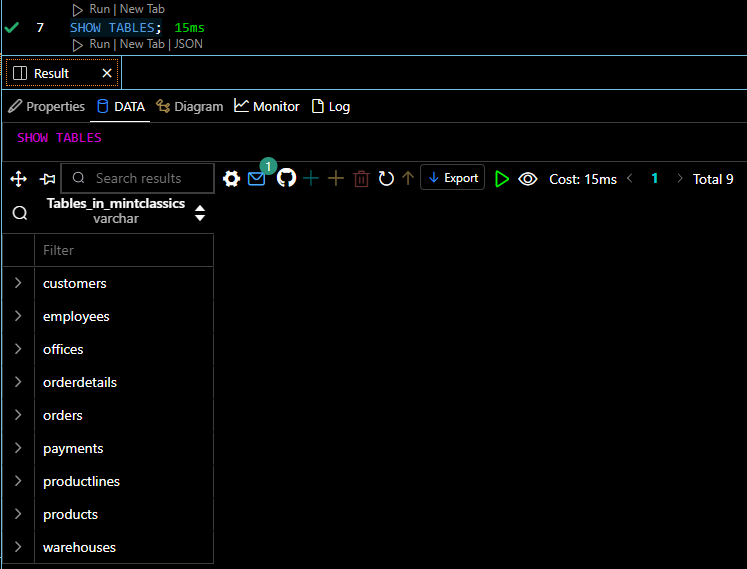
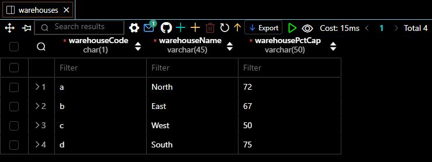
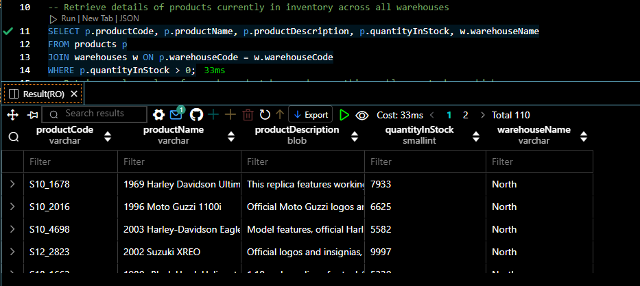
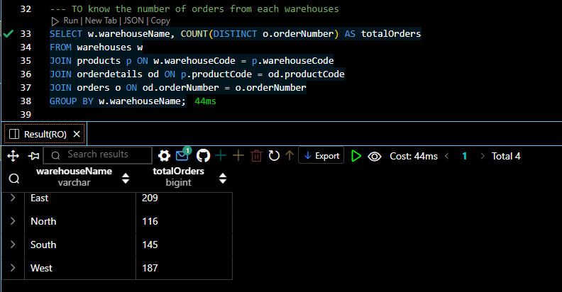
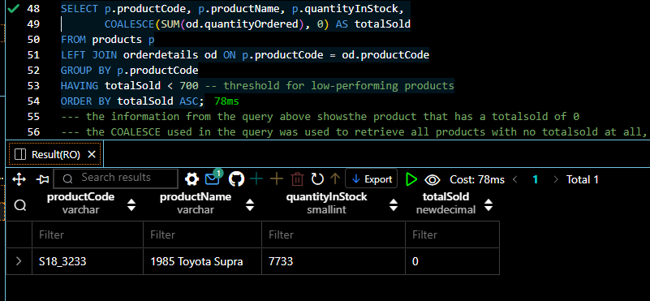
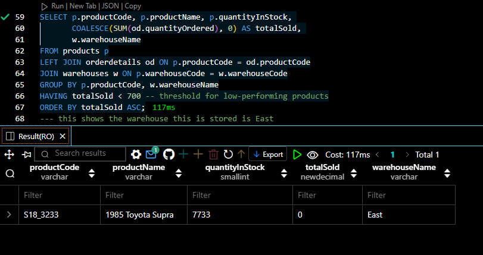

# Mintclassics
## Project Overview
Mint Classics Company, a retailer of classic model cars and other vehicles, is looking at closing one of their storage facilities. 
To support a data-based business decision, they are looking for suggestions and recommendations for reorganizing or reducing inventory, while still maintaining timely service to their customers. They would like to maintain the delivery period which is 24hours after order is being placed.
## Aim and Objectives
### Aim 
To close down one storage facilities
### Objectives
1. Explore products currently in inventory.

2. Determine important factors that may influence inventory reorganization/reduction.

3. Provide analytic insights and data-driven recommendations.
## Tools used 
SQL, Visual studio code.
## Data Exploration
This is crucial step that enable us to understand the data available in MintClassics Database. 
The image below shows the overall table available in the database 

Now that we know the tables available in the database, lets go deeper by exploring the warehouse table 

## INVENTORY ANALYSIS
To explore the products in inventory, information about the products, warehouses, and potentially orderdetails tables are needed. 

The screenshot below determined the Number of orders from each warehouse

The screenshots below was used to retrieve the low performing stock and the storage for this low performing stock.

